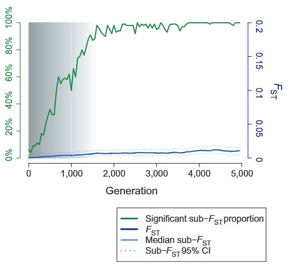

# Grey Zone Script to compute and display the results

These are exemples of the R and Python scripts used in the article ["Large‐scale genetic panmixia in the blue shark (Prionace glauca): A single 
worldwide population, or a genetic lag‐time effect of the “grey zone” of differentiation?"](https://onlinelibrary.wiley.com/doi/10.1111/eva.12591).

How to:

1. Generate data with the python files (*grey_zone.py* or *bottleneck.py*)

2. Load *plotdegrad.r*

3. Use *graph_gz.r* to generate plots, with the adjustments necessary to your data.

email: diane.bailleul.pro@gmail.com

Please, do not use (with or witout modifications) without citing SimuPop/R and the original article.
